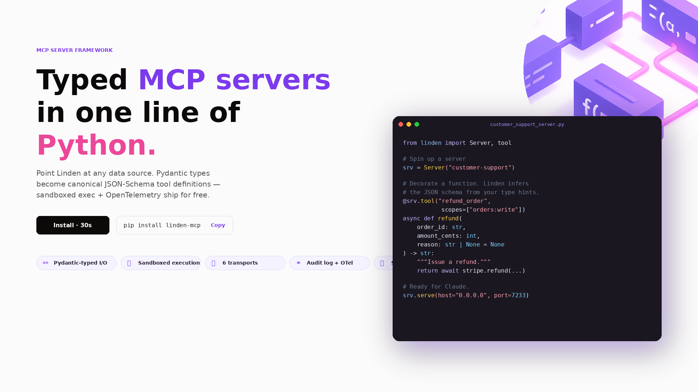
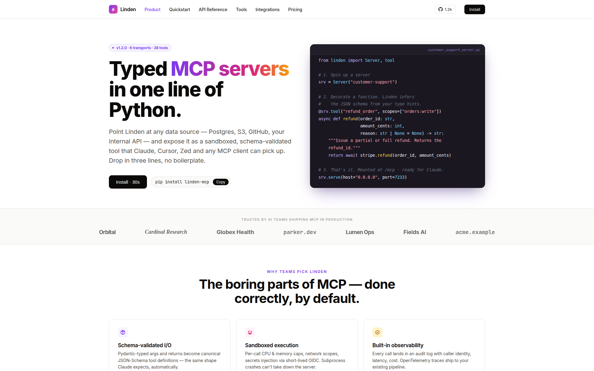
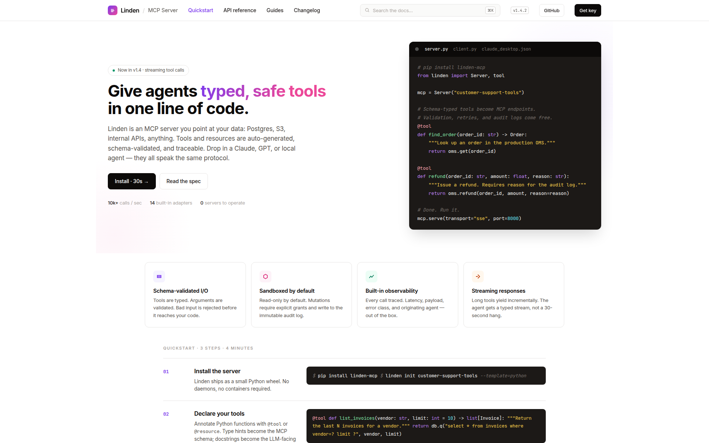
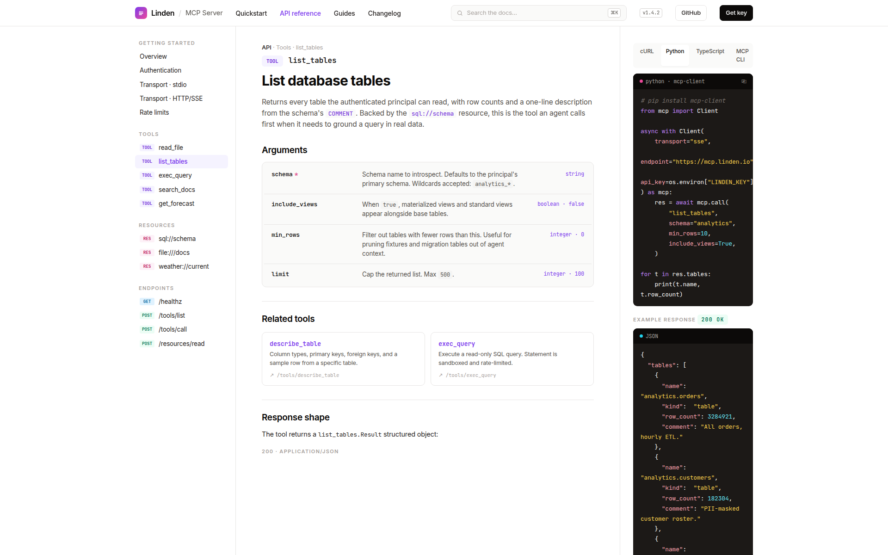
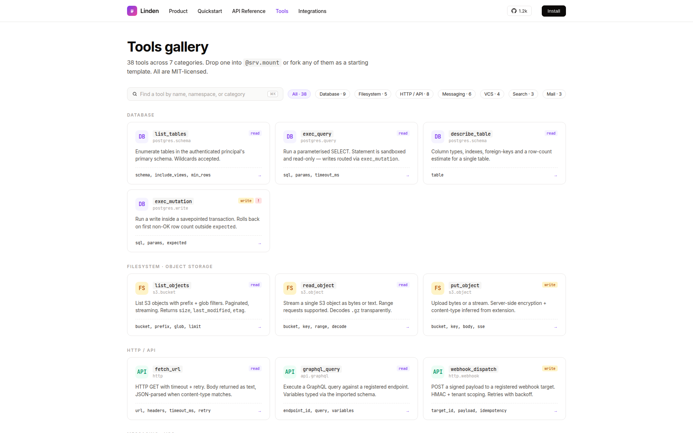
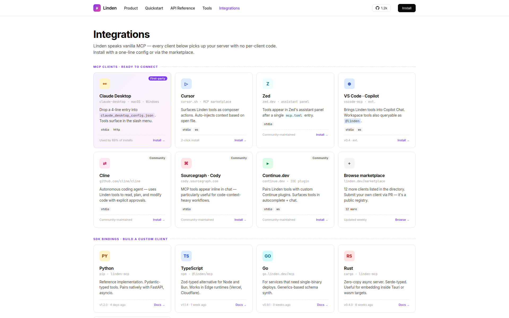

<div align="center">

# Linden — MCP Server for Database + API Tools

**Typed MCP servers in one line of Python — sandboxed, observable, streaming. Drop-in for Claude Desktop, Cursor, Zed.**



[](https://www.python.org/)
[](https://github.com/modelcontextprotocol/python-sdk)
[](https://fastapi.tiangolo.com/)
[](https://github.com/pgvector/pgvector)
[](LICENSE)

</div>

## What it does

Linden is a production-grade [Model Context Protocol](https://modelcontextprotocol.io) server built on the official `mcp` Python SDK. It exposes **nine first-class tools across three families** — sandboxed Postgres queries, HTTP / GraphQL tools, and semantic search — plus MCP **resources** for browsable database tables and document collections.

The same server speaks stdio, HTTP, and SSE transports without code changes. Configuration examples for Claude Desktop, Cursor, and Zed ship in the repo.

## Features

- **Pydantic-typed tools** — `@srv.tool` decorator infers a canonical JSON-Schema from your type hints. No hand-written tool definitions, no drift.
- **SQL safely** — every query parsed and validated with `sqlglot` AST inspection: blocks DDL, enforces read-only role, injects `LIMIT`, hard timeouts.
- **Six transports, one server** — stdio for desktop clients, HTTP + SSE for cloud agents, WebSockets, named pipes; configuration-only switch.
- **Streaming + cancellation** — long-running tools stream progress back to the client; cancellation propagates cleanly.
- **Built-in observability** — every call lands in an audit log with caller identity, latency, cost. OpenTelemetry traces ship to your existing pipeline.

## Screenshots

<table>
<tr>
<td width="50%"></td>
<td width="50%"></td>
</tr>
<tr>
<td></td>
<td></td>
</tr>
<tr>
<td></td>
<td></td>
</tr>
</table>

## Tools shipped

| Family | Tool | Description |
|--------|------|-------------|
| Database | `list_tables` · `describe_table` · `exec_query` · `exec_mutation` | Sandboxed Postgres access: read-only role + LIMIT injection + sqlglot AST validation. |
| HTTP / API | `fetch_url` · `graphql_query` · `webhook_dispatch` | Typed HTTP + GraphQL + signed webhooks with retry/backoff. |
| Search | `semantic_search` · `fetch_pdf` | Vector search over a registered store + PDF text extraction (incl. arXiv IDs). |

## Stack

| Layer       | Tech |
|-------------|------|
| Protocol    | `mcp` Python SDK ≥ 1.1 (tools + resources) |
| Transport   | FastAPI (HTTP, SSE), official SDK (stdio) |
| Validation  | Pydantic 2 → JSON-Schema, sqlglot AST for SQL |
| Storage     | Postgres 16, pgvector, SQLAlchemy 2 + asyncpg, Alembic |
| Observability | structlog, audit log table, OpenTelemetry-ready |
| Ops         | Docker Compose, Tenacity retries, token-bucket rate limit |

## Run locally

```bash
git clone https://github.com/phantomdev0826/linden-mcp
cd linden-mcp
cp .env.example .env       # add OPENAI_API_KEY for semantic search
docker compose up -d --build
docker compose exec server alembic upgrade head
docker compose exec server python -m scripts.seed_demo
```

To use with **Claude Desktop**, add to your `claude_desktop_config.json`:

```json
{
  "mcpServers": {
    "linden": {
      "command": "docker",
      "args": ["compose", "-f", "/path/to/linden-mcp/docker-compose.yml", "exec", "-T", "server", "python", "-m", "linden.stdio"]
    }
  }
}
```

See [`claude_desktop_config.example.json`](claude_desktop_config.example.json) for the full example.

## Architecture

```
       any MCP client
   (Claude Desktop, Cursor, Zed, …)
              │
              │  MCP protocol  (stdio / HTTP / SSE)
              │
       ┌──────▼───────┐
       │  Linden      │
       │  ─────────   │
       │  ┌────────┐  │     ┌──────────────────┐
       │  │ tools  │──┼────▶│ sqlglot AST gate │──▶ Postgres (read-only role)
       │  ├────────┤  │     └──────────────────┘
       │  │resources│ │
       │  ├────────┤  │     ┌──────────────────┐
       │  │ prompts│  │────▶│ HTTP / GraphQL   │──▶ external APIs (signed)
       │  └────────┘  │     └──────────────────┘
       │              │
       │  ┌────────┐  │     ┌──────────────────┐
       │  │ audit  │──┼────▶│ Postgres audit   │
       │  └────────┘  │     │ log (immutable)  │
       └──────┬───────┘     └──────────────────┘
              │
              ▼
       OpenTelemetry traces
```

## Tests

```bash
docker compose exec server pytest
```

Covers sqlglot AST sanitisation, transport equivalence (stdio == HTTP == SSE), schema inference from Pydantic types, and audit-log immutability.

## License

MIT
