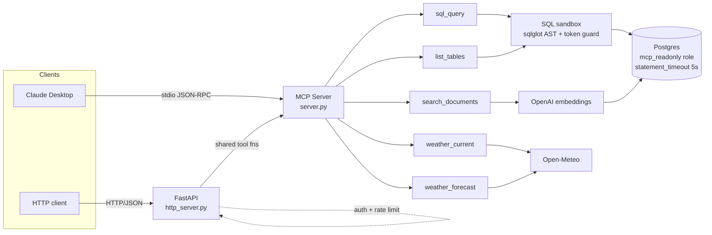

# Architecture

## Layered SQL safety

The `sql_query` tool is the most sensitive surface, so it has four layers of defense:

1. **Token guard** (`_BANNED_TOKENS` regex) rejects any query containing
   write/DDL/session-mutation keywords. Catches CTE-hidden DML like
   `WITH x AS (UPDATE ... RETURNING ...) SELECT * FROM x`.
2. **AST parse** with `sqlglot` rejects anything that isn't a `SELECT`,
   `UNION`, or `WITH`-of-`SELECT`. Multiple statements are rejected.
3. **Auto-LIMIT**: if the query has no LIMIT, the sandbox appends one;
   if it has a LIMIT above the configured cap, the cap wins.
4. **Connection role**: the sandbox runs against a separate engine that
   connects as `mcp_readonly`, a Postgres role with `SELECT` only and
   `default_transaction_read_only=on`. Even if every check above is
   bypassed, the database itself refuses to write.

A single layer would be enough most of the time. Together they ensure the
SQL tool can be exposed to an untrusted LLM without compromising the database.

## Two transports, one tool surface

The same tool functions back both transports:

- **stdio** (`server.py`) → used by Claude Desktop. No auth (local process).
- **HTTP/JSON** (`http_server.py`) → used by remote clients. API-key auth +
  token-bucket rate limit per key.

Both register identical tool names and schemas, so an integration written
against either is portable.

## Why two engines

`db.py` defines two SQLAlchemy engines:

- `admin_engine` connects as `postgres` — used by migrations and the seed
  script. Not exposed to MCP tools.
- `readonly_engine` connects as `mcp_readonly` with session-level
  `default_transaction_read_only=on` and `statement_timeout=5s`. Used by
  every MCP tool that talks to the database.

This is the connection-level half of the SQL safety story above.
